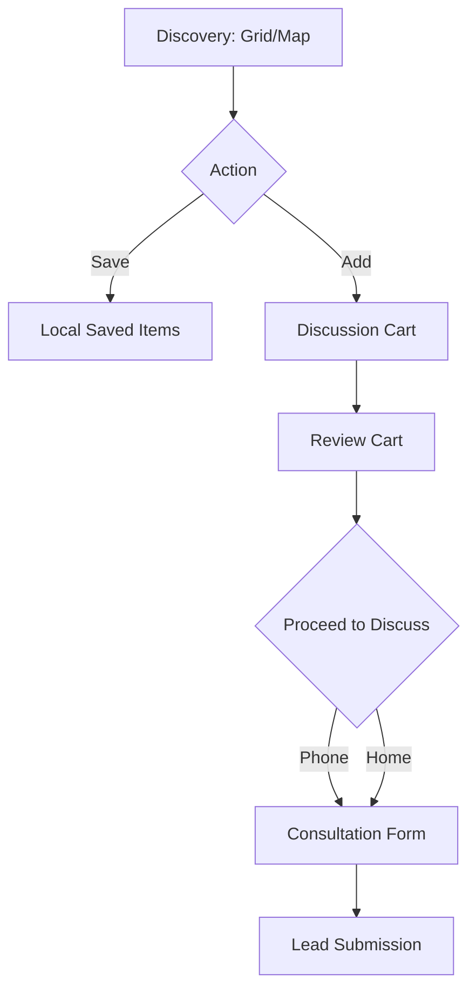

# Product Requirements Document (PRD): Premium Property Showcase & Discussion Platform

> **Project Summary**: The **absolute fastest** mobile-first showcase for curated internal property listings. This platform enables customers to discover, live-filter, and map properties **instantly** without a login. Users can save favorites or add multiple properties to a **"Discussion Cart"** (persisted via Local Storage) to initiate a unified consultation. The journey concludes with a choice of a phone-based callback or an at-home consultation, capturing essential details like budget and location to facilitate expert guidance.

## 1. Project Vision
The **Property Showcase & Discussion Platform** is an ultra-fast, high-fidelity web application designed for property seekers to discover internal curated listings and initiate expert discussions. The platform eliminates the friction of registration by using **Local Storage** for all selection and saving features.

---

## 2. Core Experience Pillars
- **Zero-Friction (No Login)**: Users can save properties and manage their discussion cart without ever creating an account.
- **Discussion Cart**: A unique "selection-to-consultation" flow where users shortlist properties for a unified discussion.
- **Absolute Peak Performance**: The platform must be the fastest possible web experience, with zero perceptible delay in navigation or filtering.
- **Mobile-First Discovery**: Robust map integration and high-response filtering for on-the-go browsing.

---

## 3. Functional Requirements

### 3.1 Discovery Layer (Map & Grid)
- **Heavy Map Integration**: High-performance map visualization with property markers that respond instantly.
- **Smart Labels**: Dynamic labels on list items (e.g., "Ready to Move", "High ROI") to provide quick highlights.
- **Paginated Discovery**: Efficient pagination for both the grid and map to ensure performance remains high as the catalog grows.
- **Instant Result Filters**: High-speed filtering by Budget, Type, and Area.
- **Visual Grid**: High-resolution image-first cards for all properties.

### 3.2 Performance & Caching Strategy
- **Result Caching (localStorage)**: Store fetched property data in `localStorage` to allow for instant re-loads and offline persistence during browsing.
- **Less Eager Usage**: Implement lazy-loading for the map and off-screen images to prioritize the main thread.
- **Proper Refresh Mechanism**: A dedicated "Refresh" flow that invalidates the local cache and fetches fresh data from Supabase without breaking the UI state.

| Metric | Target Goal | Implementation Strategy |
| :--- | :--- | :--- |
| **Speed** | **Perceived Instant** | `localStorage` caching of results + Less Eager Loading + ISR. |
| **Interactivity** | **Zero-Latency** | Map-First Discovery + Paginated Grid + Client-side Refresh. |
| **Mobile Feel** | Native-App Grade | Fluid Map transitions and high-response list labels. |
| **Engagement** | Seamless Conversion | Sticky contact bars and 1-tap WhatsApp deep-linking. |
- **Visual Grid**: High-resolution image-first cards for all properties.

### 3.2 Interaction & Persistence (Local Storage Powered)
- **The Discussion Cart**: 
    - A specialized cart system where users can "Add to Discussion".
    - A dedicated "Discussion Cart" view that lists all selected properties for review.
    - Data is persisted entirely in the browser's **Local Storage**.
- **Saved Properties**: 
    - A heart/save icon on every card to bookmark favorites.
    - A "Saved" view to quickly revisit properties.
    - No login required; state is managed via Local Storage.

### 3.3 The Discussion Flow (Conversion)
After shortlisting properties in the Discussion Cart, users can proceed to "Discuss" via two specific channels:
1.  **Discuss on Phone**: Request a callback for a telephonic consultation.
2.  **Discuss at Home**: Request a physical visit/consultation at their residence.

**Callback/Discussion Form Requirements:**
- Full Name
- Phone Number
- Alternate Phone Number
- Current Address (Required for "Home Discussion")
- Budget Range
- Selected Properties (Automatically linked from the Cart)

---

## 4. Non-Functional Requirements (Customer Speed & UI)

### 4.1 Absolute Performance Shell
- **Zero-Latency State**: Adding to cart or saving a property must be instantaneous. All interactions must happen with zero perceptible delay.
- **Instant Assets**: Image delivery must be so optimized that "loading" is invisible to the user.
- **Next.js Static Power**: Pre-rendering the entire catalog for the fastest possible first paint.

### 4.2 High-Response Mobile UI
- **Sticky Discussion Hub**: A floating action button or sticky bottom bar showing the count of properties in the Discussion Cart.
- **Native Gestures**: Swipe-to-remove from the Discussion Cart.

---

### 5.1 Technology Stack & Data Source
- **Framework**: Next.js 15 (App Router).
- **Persistence**: Browser `localStorage` for Cart and Favorites.
- **Database**: **Supabase** (Real-time Property Catalog).
    - **Source View**: `public_properties_view`
    - **Customer-Facing Data Columns**: 
        - `public_id`, `property_id`, `city`, `area`, `type`, `description`
        - `size_min`, `size_max`, `size_unit`, `price_min`, `price_max`
        - `tags`, `highlights`, `image_urls`, `is_photos_public`
        - `landmark_location`, `landmark_location_distance`
        - `status`, `approved_on`.
- **Maps**: Google Maps Platform with high-performance marker rendering.
- **Leads**: Supabase Edge Functions for routing discussion requests.

---

## 6. Visual Architecture & Flow

---

## 7. Roadmap & Next Steps
1. **Design Mockups**: Create high-fidelity mobile designs for the "Discussion Cart" and the "Callback Form".
2. **Local Storage Logic**: Implement the custom hooks for managing cart state without a backend.
3. **Core Shell**: Build the responsive Navbar, Map interface, and the Sticky Discussion Hub.

## 8. Success Metrics
1. **Perceived Speed**: Immediate reaction to every click/tap.
2. **Mobile Compliance**: Perfect Lighthouse scores across all performance categories.
3. **Frictionless Conversion**: Total absence of "loading" spinners or wait states during the discussion flow.
